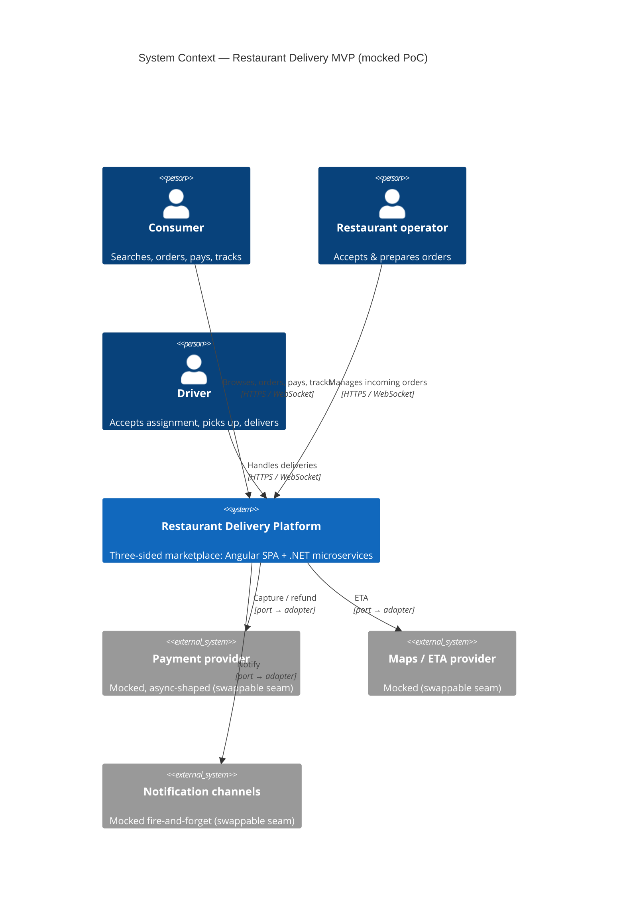
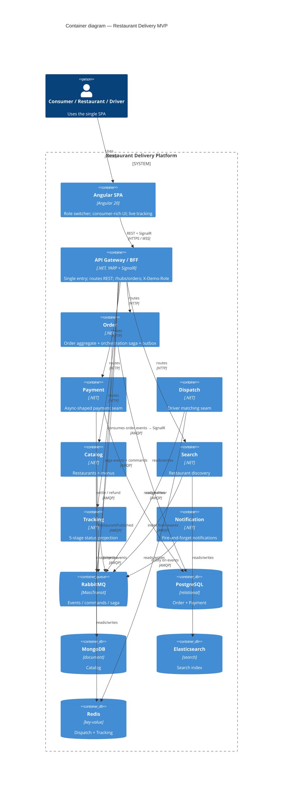
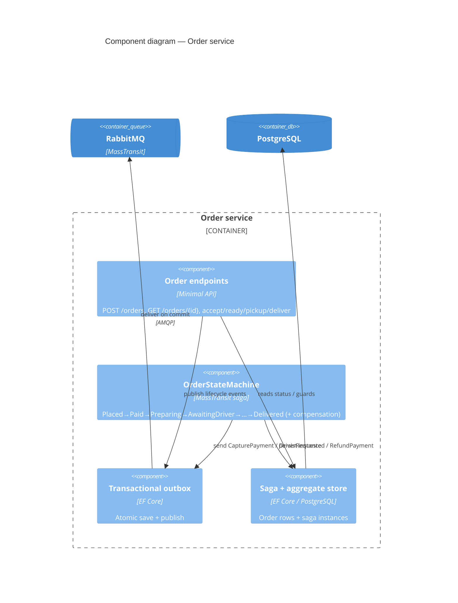
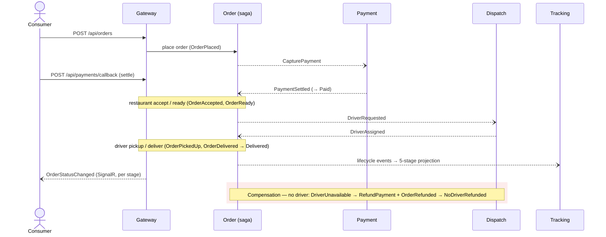

# Restaurant Delivery MVP

A mocked, microservices-based food-delivery marketplace (iFood-style), built as a proof-of-concept and
**foundation for a real product**. It delivers the full three-sided journey — **consumer**, **restaurant**,
and **driver** — over seven independent .NET services behind a YARP gateway, with an Angular SPA and
real-time order tracking. Every external dependency (payment, maps/ETA, notifications) is a *mock behind a
swappable port*.

Stack: **.NET 10 microservices + Angular 20**. Async backbone: **RabbitMQ / MassTransit** with an
orchestrated **saga** (transactional outbox). Polyglot persistence per service. Planning artifacts live under
[`.compozy/tasks/restaurant-delivery-mvp/`](.compozy/tasks/restaurant-delivery-mvp/) (`_idea.md`, `_prd.md`,
`_techspec.md`, `_tasks.md`, `adrs/`). Consolidated architecture: [`SYSTEM_DESIGN.md`](SYSTEM_DESIGN.md).
UI conventions: see [`DESIGN_SYSTEM.md`](DESIGN_SYSTEM.md).

---

## Architecture (C4)

### Level 1 — System Context



### Level 2 — Containers



### Level 3 — Order service components (the core)



### Runtime — happy path + compensation



---

## Services

| Service | Responsibility | Datastore | Notes |
| ------- | -------------- | --------- | ----- |
| **Gateway** | Single entry (YARP), role switcher, SignalR hub | — | `/hubs/orders`, `X-Demo-Role` |
| **Search** | Restaurant discovery | Elasticsearch | indexes from `RestaurantPublished` |
| **Catalog** | Restaurants + menus | MongoDB | seeds + publishes `RestaurantPublished` |
| **Order** | Order aggregate + orchestration saga | PostgreSQL | transactional outbox |
| **Payment** | Async-shaped payment seam | PostgreSQL | idempotent; declinable; swappable |
| **Dispatch** | Driver matching seam | Redis | nearest-available mock; swappable |
| **Tracking** | 5-stage status projection | Redis | rebuildable from events |
| **Notification** | Fire-and-forget notifications | stateless | swappable channel |

Shared libraries: `src/Shared/Contracts` (integration events/commands), `src/Shared/Platform`
(MassTransit + Serilog + correlation + health + idempotency), `src/Shared/Bootstrap` (infra smoke check).

---

## Running it

### Prerequisites
- .NET SDK (pinned in [`global.json`](global.json)) · Docker / Docker Compose · Node 20+ (for the SPA)

### Infrastructure only (datastores + broker)
```bash
docker compose up -d --wait rabbitmq postgres mongo elasticsearch redis
```
| Service | Host port(s) | Used by |
| ------- | ------------ | ------- |
| RabbitMQ | 5682→5672 (AMQP), 15682→15672 (UI) | all (async backbone) |
| PostgreSQL | 5432 | Order, Payment |
| MongoDB | 27017 | Catalog |
| Elasticsearch | 9200 | Search |
| Redis | 6379 | Dispatch, Tracking |

### Full stack (all services + gateway + web)
```bash
docker compose build                 # builds 9 images (7 services + gateway + web)
docker compose up -d --wait --wait-timeout 300   # all 14 containers; no license required
# Web UI:  http://localhost:4200      Gateway API: http://localhost:8080
docker compose down
```

Verified end-to-end on the composed stack: a live journey through the gateway
(`place → settle → accept → ready → pickup → deliver`) reaches tracking stage 5 (Delivered).

### Build & test (.NET)
```bash
dotnet build
dotnet test                                  # all tests (integration uses Testcontainers → needs Docker)
dotnet test --filter "Category!=Integration" # unit tests only (no Docker)
```

### Angular app
```bash
cd src/Web
npm install
npm start            # dev server on http://localhost:4200 (point environment.apiBase at the gateway)
npm run build        # production build
npm run test:coverage
```

---

## Repository layout
```
src/
  Shared/      Contracts · Platform · Bootstrap (shared libraries)
  Services/    Search · Catalog · Order · Payment · Dispatch · Tracking · Notification
  Gateway/     API Gateway / BFF + SignalR hub
  Web/         Angular SPA (consumer / restaurant / driver)
tests/         per-service test projects + E2E.Tests (full-stack)
Dockerfile     parameterized multi-stage build for all .NET services + gateway
docker-compose.yml   infra + application tier
infra/         postgres init (creates order + payment databases)
```

## Quality
- **~297 tests**: per-service unit + integration (Testcontainers: RabbitMQ, PostgreSQL, MongoDB, Redis,
  Elasticsearch), a **full-stack E2E** through the gateway with a real SignalR client, and Angular (Jest).
- Coverage: .NET services 90–100%, Gateway ~95%, Angular ~97% (`Program.cs` composition roots excluded via
  `coverlet.runsettings`).

## Known limitations
- **Messaging library:** the services use **MassTransit 8.5.10 (Apache-2.0)** so the RabbitMQ transport and
  the full `docker compose up` run require **no license**. (MassTransit 9 made the RabbitMQ transport
  commercial — needing `MT_LICENSE` — which is why this project pins v8.)
- **Mocked PoC:** payment, maps/ETA, and notifications are mocks behind swappable ports; no real money or PII.
- **Scope:** one happy path + one compensation (no-driver → refund); broad edge cases are out of scope (see
  `_prd.md` Non-Goals).
