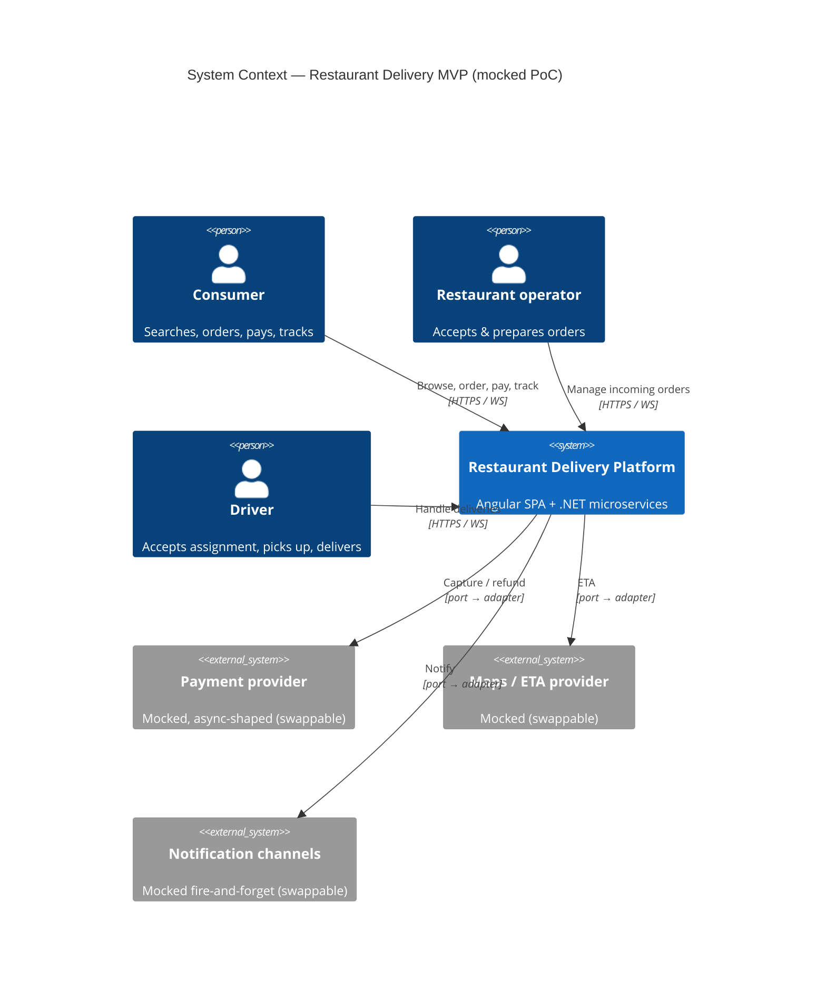
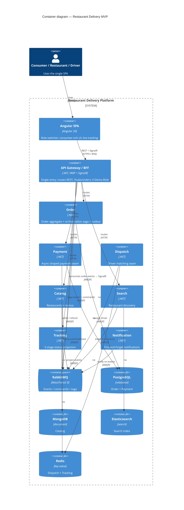
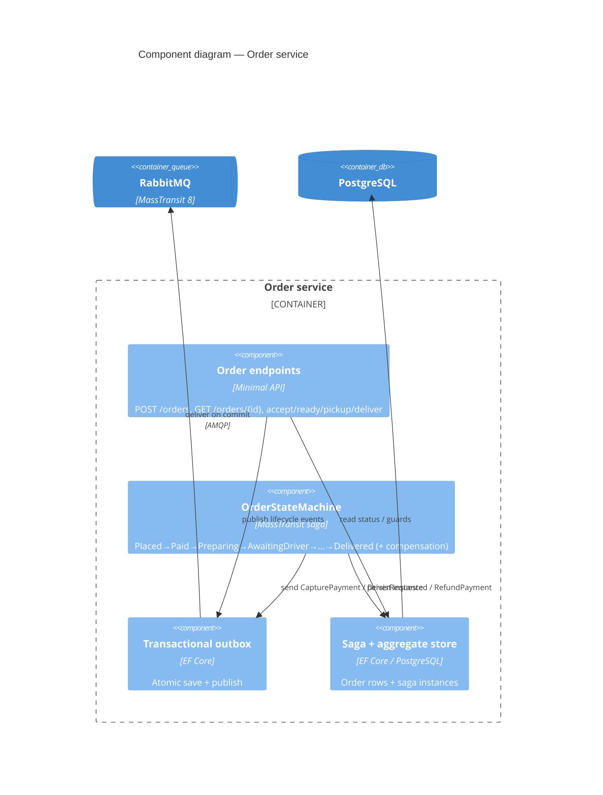
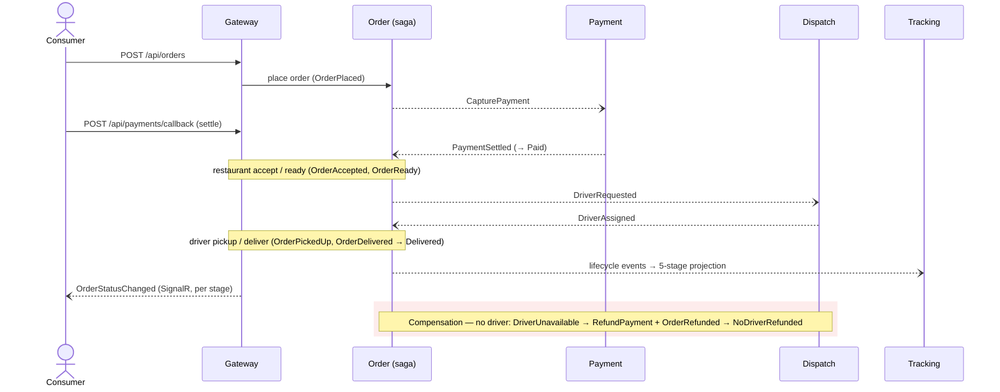

# System Design — Restaurant Delivery MVP

A consolidated system design document (SDD) for the mocked, microservices-based food‑delivery marketplace
(iFood‑style). It gathers the architecture in one place and references — rather than duplicates — the deeper
artifacts:

- Business scope: [`_idea.md`](.compozy/tasks/restaurant-delivery-mvp/_idea.md), [`_prd.md`](.compozy/tasks/restaurant-delivery-mvp/_prd.md)
- Technical spec (interfaces, data models, API, build order): [`_techspec.md`](.compozy/tasks/restaurant-delivery-mvp/_techspec.md)
- Decisions: [`adrs/`](.compozy/tasks/restaurant-delivery-mvp/adrs/) (ADR‑001…007)
- UI design language: [`DESIGN_SYSTEM.md`](DESIGN_SYSTEM.md)

---

## 1. Overview & goals

A three‑sided delivery marketplace — **consumer**, **restaurant**, **driver** — implemented as seven .NET
microservices behind a YARP gateway, with an Angular SPA and real‑time order tracking. It is a
**proof‑of‑concept and foundation for a real product**: every external dependency (payment, maps/ETA,
notifications) is a *mock behind a swappable port*.

**Design goals**

1. Demonstrate a complete, fulfillable order across all three sides, including driver assignment and delivery.
2. Prove **swappable seams** — a mock integration can be replaced by a real provider without rewriting neighbors.
3. A **legible, real‑time** demo: one order whose status updates across all three views in near‑real‑time.
4. A license‑free, one‑command runnable stack (foundation the team can extend toward production).

**Non‑goals (V1):** combinatorial edge cases beyond one compensation path; real integrations; global/batched
driver matching; identity/auth; production hardening. See `_prd.md` → Non‑Goals.

---

## 2. Architecture (C4)

### 2.1 System Context



### 2.2 Containers



### 2.3 Order service components (the core)



---

## 3. Services & responsibilities

| Service | Responsibility | Datastore | Key seam / note |
| ------- | -------------- | --------- | --------------- |
| **Gateway / BFF** | Single client entry; YARP routing; role switcher; SignalR hub | — | `X-Demo-Role`; `/hubs/orders` |
| **Search** | Restaurant discovery (name/cuisine) | Elasticsearch | indexes from `RestaurantPublished` (events only) |
| **Catalog** | Restaurants + menus; seed | MongoDB | publishes `RestaurantPublished` |
| **Order** | Order aggregate + orchestration saga | PostgreSQL | transactional outbox; the system's core |
| **Payment** | Async‑shaped payment | PostgreSQL | `IPaymentPort` (mock + stub‑real); declinable; idempotent |
| **Dispatch** | Driver matching | Redis | `IDriverMatcher` (nearest‑available mock) |
| **Tracking** | 5‑stage status projection | Redis | atomic monotonic; feeds the hub |
| **Notification** | Fire‑and‑forget notifications | stateless | `INotificationPort` |

Shared libraries: `src/Shared/Contracts` (messages), `src/Shared/Platform` (MassTransit + Serilog +
correlation + health + idempotency), `src/Shared/Bootstrap` (infra smoke check).

---

## 4. Data & persistence (polyglot — ADR‑006)

Each service owns its data; **no service reads another's store** — cross‑service data flows only via events
(ADR‑004).

- **PostgreSQL** — Order (order aggregate + saga instances + EF outbox) and Payment (payment records,
  unique idempotency key) on separate databases (`order`, `payment`).
- **MongoDB** — Catalog (restaurants + nested menus).
- **Elasticsearch** — Search (restaurant index, fed by events).
- **Redis** — Dispatch (driver availability/geo) and Tracking (5‑stage projection; atomic monotonic
  compare‑and‑set so concurrent same‑order events never regress the stage).

Core entities and request/response shapes: see `_techspec.md` → *Data Models* / *API Endpoints*.

---

## 5. Messaging & the order saga

**Backbone:** RabbitMQ via **MassTransit 8.5.10** (Apache‑2.0). Async events/commands between services;
synchronous REST only for client‑facing reads via the gateway. Contracts live in `RestaurantDelivery.Contracts`.

**Events:** `OrderPlaced`, `PaymentAccepted`, `PaymentSettled`, `PaymentDeclined`, `OrderAccepted`,
`OrderReady`, `DriverRequested`, `DriverAssigned`, `DriverUnavailable`, `OrderPickedUp`, `OrderDelivered`,
`OrderRefunded`, and the catalog event `RestaurantPublished`.
**Commands:** `CapturePayment`, `RefundPayment` (and `RequestDriver`).

**Order saga** (`OrderStateMachine`, EF Core saga repository + transactional outbox):

```
Initial --OrderPlaced--> AwaitingPayment           (publishes CapturePayment)
AwaitingPayment --PaymentSettled--> Paid
AwaitingPayment --PaymentDeclined--> Faulted        (terminal)
Paid --OrderAccepted--> Preparing
Preparing --OrderReady--> AwaitingDriver            (publishes DriverRequested)
AwaitingDriver --DriverAssigned--> DriverAssigned
AwaitingDriver --DriverUnavailable--> NoDriverRefunded   (publishes RefundPayment + OrderRefunded)  [compensation]
DriverAssigned --OrderPickedUp--> PickedUp
PickedUp --OrderDelivered--> Delivered              (terminal)
```

Orchestration (central coordinator) was chosen over choreography for a visible, debuggable lifecycle with a
clear compensation path (ADR‑004). The saga emits the **`DriverRequested` event** (consumed by Dispatch);
the redundant `RequestDriver` command in Contracts is unused.

---

## 6. Runtime flows



**Payment is async‑shaped:** `CaptureAsync` returns *accepted*; settlement arrives via
`POST /api/payments/callback` (mock PSP), which publishes `PaymentSettled`/`PaymentDeclined`. This keeps the
seam shaped like a real provider so swapping in Stripe/PIX later needs no caller changes.

---

## 7. Cross‑cutting concerns / NFRs

- **Idempotency** — consumers are idempotent on `(OrderId, CorrelationId)` via `IIdempotencyStore`; the saga
  is structurally idempotent (state correlation + `OnUnhandledEvent → Ignore`); Payment dedupes on an
  idempotency key (unique index).
- **Reliable publishing** — Order uses the **EF Core transactional outbox** (atomic save + publish); HTTP
  endpoints flush the outbox (`SaveChangesAsync`) so events are delivered.
- **Real‑time** — the gateway consumes order events and pushes `OrderStatusChanged` over **SignalR**
  (`/hubs/orders`, per‑order groups); clients resync on (re)connect via `GET /api/orders/{id}/status`.
  Target: a role action reflects in other views in ≤ ~2 s (ADR‑007).
- **Swappable seams** — payment, maps/ETA, notifications behind ports/adapters; payment & notification are
  async‑shaped even while mocked, so real providers plug in without neighbor changes (ADR‑001).
- **Observability** — Serilog structured logging with a correlation id propagated across HTTP and messages;
  `/health` per service; MassTransit bus health surfaced through the gateway.
- **Access model** — no auth in V1; a role switcher (`X-Demo-Role` + pre‑seeded identities) selects the
  consumer/restaurant/driver view (ADR‑002).

---

## 8. Quality attributes & scaling notes

- **Independent deployability** — each service is its own process + datastore; events decouple them.
- **Resilience** — MassTransit retry/redelivery + the outbox + saga timeouts keep the order state consistent;
  the single compensation prevents "paid but undelivered" orphans.
- **Scale path (post‑PoC)** — services scale independently; the nearest‑available matcher swaps for a
  batched/ETA matcher behind `IDriverMatcher`; the in‑code orchestration can move to a workflow engine
  (Temporal/Cadence) behind the same boundary; Tracking is a disposable projection rebuildable from events.

---

## 9. Deployment / runtime topology

One‑command full stack via `docker compose` — 5 infrastructure + 7 services + gateway + web (14 containers),
all built from a single parameterized `Dockerfile` (services/gateway) plus `src/Web/Dockerfile` (Angular →
nginx). **No license required** (MassTransit 8). See [`README.md`](README.md) → *Running it*.

| Container | Host port | Notes |
| --------- | --------- | ----- |
| web (Angular/nginx) | 4200 | calls the gateway |
| gateway (YARP + SignalR) | 8080 | single API + `/hubs/orders` |
| services (×7) | internal only | `:8080` in‑network; `/health` |
| rabbitmq | 5682→5672, 15682→15672 | internal `rabbitmq:5672` |
| postgres / mongo / elasticsearch / redis | 5432 / 27017 / 9200 / 6379 | per‑service stores |

---

## 10. Testing strategy

- **~297 tests.** Per‑service unit + integration with **Testcontainers** (RabbitMQ, PostgreSQL, MongoDB,
  Redis, Elasticsearch); a **full‑stack E2E** that drives the journey through the gateway with a real SignalR
  client; the Angular SPA with **Jest**.
- Coverage: .NET services 90–100%, Gateway ~95%, Angular ~97% (`Program.cs` composition roots excluded).
- Tests run **serially** (xunit parallelization disabled + `MaxCpuCount=1`) for determinism with the
  in‑memory message harness. Verified license‑free end to end (`docker compose up` → order reaches
  *Delivered*).

---

## 11. Known limitations & key decisions

- **Messaging:** MassTransit **8.5.10 (Apache‑2.0)** — no license needed (v9's RabbitMQ transport is
  commercial; hence the pin to v8).
- **Mocked PoC:** payment, maps/ETA, notifications are mocks; no real money or PII.
- **Scope:** one happy path + exactly one compensation (no‑driver → refund); other edge cases are Non‑Goals.

---

## 12. Architecture Decision Records

| ADR | Title |
| --- | ----- |
| [ADR‑001](.compozy/tasks/restaurant-delivery-mvp/adrs/adr-001.md) | V1 scope — full three‑sided journey on swappable seams |
| [ADR‑002](.compozy/tasks/restaurant-delivery-mvp/adrs/adr-002.md) | V1 product approach — fulfillable‑order layering; role switcher |
| [ADR‑003](.compozy/tasks/restaurant-delivery-mvp/adrs/adr-003.md) | Technology stack — .NET + Angular |
| [ADR‑004](.compozy/tasks/restaurant-delivery-mvp/adrs/adr-004.md) | Inter‑service communication & saga orchestration |
| [ADR‑005](.compozy/tasks/restaurant-delivery-mvp/adrs/adr-005.md) | Service decomposition — seven services + gateway |
| [ADR‑006](.compozy/tasks/restaurant-delivery-mvp/adrs/adr-006.md) | Polyglot persistence — datastore per service |
| [ADR‑007](.compozy/tasks/restaurant-delivery-mvp/adrs/adr-007.md) | Real‑time status updates — SignalR hub |

> Note: this SDD consolidates and links the design. The authoritative implementation‑level detail (exact
> interfaces, schemas, endpoint contracts, build order) remains in
> [`_techspec.md`](.compozy/tasks/restaurant-delivery-mvp/_techspec.md).
